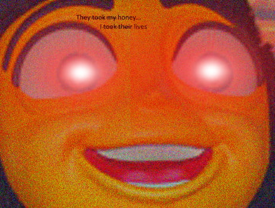

# Maturitní témata z předmětu WA na SPŠE Ječná
Zpracovaná témata na maturitu z předmětu **WA (webové aplikace)** na SPŠE Ječná pro rok 2024.
## Odkazy:
1. [HTTP protokol - stavy, autentizace, HTTPS a SSL](/topics/1%20-%20HTTP%20-%20stavy,%20autentizace,%20HTTPS%20a%20SSL.md)
2. [Webový server - konfigurace, provoz, cachování, bezpečnost](/topics/2%20-%20Webový%20server%20-%20konfigurace,%20provoz,%20cachování,%20bezpečnost.md)
3. [Webový klient - konfigurace, jádro prohlížeče, DOM, BOM](/topics/3%20-%20Webový%20klient%20-%20konfigurace,%20jádro%20prohlížeče,%20DOM,%20BOM.md)
4. [Asynchroní a synchroní komunikace na webu](/topics/4%20-%20Asynchroní%20a%20synchroní%20komunikace%20na%20webu.md)
5. [REST (Representational State Transfer) - identifikátor, HATEOAS, CRUD](/topics/5%20-%20REST%20-%20identifikátor,%20HATEOAS,%20CRUD.md)
6. [Optimalizace webu - caching , CDN, SEO, loading optimization](/topics/6%20-%20Optimalizace%20webu%20-%20caching%20,%20CDN,%20SEO,%20loading%20optimization.md)
7. [CMS (Content management system)](/topics/7%20-%20CMS%20(Content%20management%20system).md)
8. [Proces vývoje webých aplikací](/topics/8%20-%20Proces%20vývoje%20webých%20aplikací.md)
9. [Proces nasazení webové aplikace](/topics/9%20-%20Proces%20nasazení%20Webové%20Aplikace.md)
10. [Provoz webového serveru - logování, bug a issue tracking](/topics/10%20-%20Provoz%20webového%20serveru%20-%20logování,%20bug%20a%20issue%20tracking.md)
11. [Zabezpečení webových aplikací](/topics/11%20-%20Zabezpečení%20webových%20aplikací.md)
12. [HTML - struktura, sémantika, formuláře, multimédia](/topics/12%20-%20HTML%20struktura,%20sémantika,%20formuláře,%20multimédia.md)
13. [CSS - syntaxe, selektory, box model](/topics/13%20-%20CSS%20syntaxe,%20selektory,%20box%20model.md)
14. [Skriptování na straně klienta](/topics/14%20-%20Skriptování%20na%20straně%20klienta.md)
15. [Skriptování na straně serveru](/topics/15%20-%20Skriptování%20na%20straně%20serveru.md)
16. [PHP (Hypertext Preprocessor PHP) - základní konstrukce jazyka](/topics/16%20-%20PHP%20(Hypertext%20Preprocessor%20PHP)%20-%20základní%20konstrukce%20jazyka.md)
17. [Layout, komponenty a navigační prvky](/topics/17%20-%20Layout,%20komponenty%20a%20navigační%20prvky.md)
18. [Cookies - formát, expirace, tracking cookies](/topics/18%20-%20Cookies%20-%20formát,%20expirace,%20tracking%20cookies.md)
19. [Sessions - zpracování, vztah mezi ssessions a cookies](/topics/19%20-%20Sessions%20-%20zpracování,%20vztah%20mezi%20ssessions%20a%20cookies.md)
20. [CSS framework](/topics/20%20-%20CSS%20framework.md)
21. [Frontend web framework](/topics/21%20-%20Frontend%20web%20framework.md)
22. [Backed web framework](/topics/22%20-%20Backed%20web%20framework.md)
23. [Responzivní design a přístupnost](/topics/23%20-%20Responzivní%20design%20a%20přístupnost.md)
24. [Výběr technologií pro web - porovnání technologií, ocenění, udržitelnost vývoje](/topics/24%20-%20Výběr%20technologií%20pro%20web%20-%20porovnání%20technologií,%20ocenění,%20udržitelnost%20vývoje.md)
25. [Web v kontextu vývoje společnosti - přínosy, rizika a dopady, predikce budoucího vývoje](/topics/25%20-%20Web%20v%20kontextu%20vývoje%20společnosti%20-%20přínosy,%20rizika%20a%20dopady,%20predikce%20budoucího%20vývoje.md)
## Style guide:
- každé téma má **h1** nadpis, který se shoduje s názvem souboru a obsahuje číslo maturitní otázky
- každé téma má **h2** nadepsanou sekci "O čem mluvit?"
- podnadpisy jsou **h2**, je možné pod nimi používat i h3, h4, atd. ale jen výjimečně a kde to dává smysl, podstatné je zachovat hierarchii
- nadpisy začínají velkým písmenem
- vše je napsáno stylisticky hezky a nic nevypadá hrozně!
- failure to comply will result in **death** 

