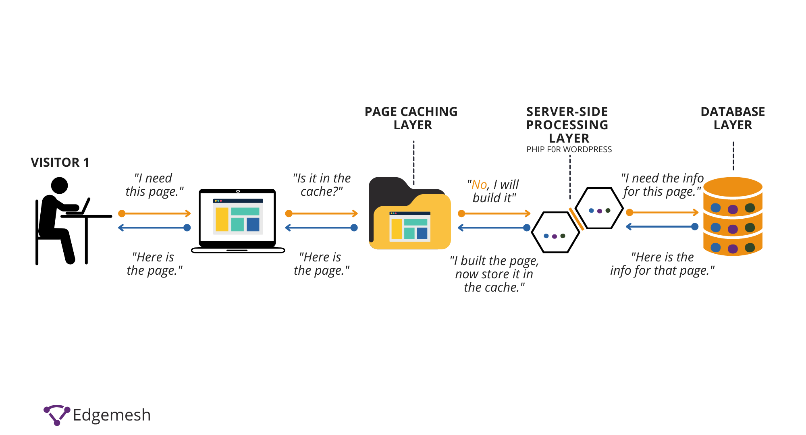
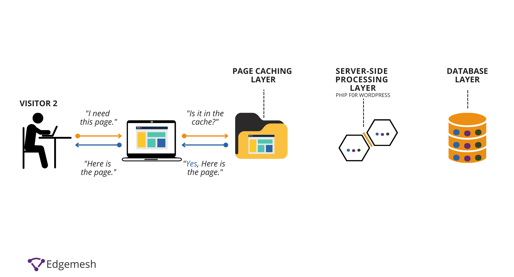

# Optimalizace webu - caching , CDN, SEO, loading optimization

## O čem mluvit?
- popsat optimalizaci webu
	- proč
	- k čemu je to dobré
	- je nějaký konečný stav stránky, nebo se optimalizuje neustále?
- caching
	- co to je
	- k čemu je dobrý
	- jak funguje
	- jak se tím optimalizuje web
- CDN
	- popsat jak funguje
	- jak to optimalizuje náš web
- SEO
	- popsat
	- co musíme udělat aby naše stránka měla dobré SEO skóre
- optimalizace načítání
	- jak můžeme zrychlit načítání obsahu na **stránce**

## Ondrova poznámka
> "Myslím že určitě bude Adámek ale chtít server-side a client-side caching.
> Je potřeba vědět ten rozdíl no a že věci jako CSS prohlížeč cachuje i defaultně. Ale ta implementace je podstatně odlišná.
> U klienta to cachuje prohlížeč a dost limitovaně, na serveru to děláš jak si to naprogramuješ."

## Optimalizace webu
- Proces používání nástrojů, pokročilých strategií a experimentů ke zlepšení výkonu webových stránek
- Cílem optimalizace webu je co nejvíce zpříjemnit "pobyt" uživatele na webové stránce - stránka je dobře viditelná na internetu, má rychlé načítání obsahu, dobře čitelný obsah, atd. 
- Toto může vést k větší návštěvnosti webu -> větší zisk (podle webové stránky samozřejmě, např. e-shop)
- Optimalizace webu je nekončící proces :(

## Caching
- Ukládání obsahu do mezipaměti je jedním z nejúčinnějších způsobů, jak zlepšit zážitek návštěvníků vašeho webu
- Ukládání do mezipaměti, neboli dočasné ukládání obsahu z předchozích požadavků, je součástí základní strategie doručování obsahu implementované v rámci protokolu HTTP
- Komponenty v celé cestě doručení můžou všechny položky ukládat do mezipaměti, aby se urychlily následné požadavky, a to v souladu se zásadami ukládání do mezipaměti deklarovanými pro obsah
- Co cachujeme? Jakýkoliv statický obsah, jako jsou obrázky, styly, JS soubory a i stažitelný obsah
- Obsah který rozhodně necachujeme jsou např. citlivé údaje, nebo obsah, který je uživatelsky specifický
- Typicky se cachuje buďto na straně server (Server-side caching) nebo na straně uživatele (Client-side caching), liší se v tom, kde je obsah stránky ukládán

**Jak funguje ukládání webových stránek do mezipaměti?**

- Uživatel vytvoří požadavek na webovou stránku prostřednictvím svého prohlížeče na prostředek ze zdrojového serveru
- Tímto datovým zdrojem je webová adresa – `https://www.example.com/how-it-works`
- Na základě tohoto požadavku prohlížeč, CDN nebo mezipaměť serveru nejprve zkontroluje, zda kopie požadované webové stránky již existuje
- V procesu kontroly, zda je mezipaměť k dispozici, uživatel odešle požadavek na webovou stránku a výsledek se rozdělí mezi 2 možné scénáře:
  - **Scénář 1**: Chyba mezipaměti: Pokud v mezipaměti není nalezena žádná kopie požadované webové stránky, bude to mít za následek chybějící odpověď mezipaměti – a prohlížeč bude muset provést nový požadavek z hlavního serveru. Mezitím, pokud je webová stránka uložena v mezipaměti, prohlížeč pokračuje v doručování verzí uložených v mezipaměti z místa, kde je uložena, dokud není vymazána nebo nevyprší její platnost.
    
  - **Scénář 2**: Požadavek na mezipaměť: Předpokládejme, že kopie požadované webové stránky je uložena v mezipaměti. V takovém případě dojde k odpovědi na přístup do mezipaměti a prostředek obsažený v mezipaměti se doručí uživateli.
    

**Výhody**

- _Snížené náklady na síť_: Obsah je možné ukládat do mezipaměti v různých bodech síťové cesty mezi příjemcem obsahu a původem obsahu. Když je obsah uložen do mezipaměti blíže k příjemci, požadavky nezpůsobí mnoho dalších síťových aktivit nad rámec mezipaměti.
- _Vylepšená odezva_: Ukládání do mezipaměti umožňuje rychlejší načítání obsahu, protože není nutná celá síť. Mezipaměti udržované v blízkosti uživatele, jako je mezipaměť prohlížeče, mohou toto načtení téměř okamžitě načíst.
- _Vyšší výkon na stejném hardwaru_: Na serveru, ze kterého obsah pochází, lze ze stejného hardwaru vymáčknout více výkonu povolením agresivního ukládání do mezipaměti. Vlastník obsahu může využít výkonné servery podél doručovací trasy, aby převzal hlavní nápor určitého načítání obsahu.

## CDN (Content Delivery/Distribution Network)
- CDN je geograficky distribuovaná síť serverů umístěných po celém světě
- Slouží k rychlejší distribuci obsahu na webu a rychlejšímu načítání stránek
- V CDN serveru jsou uloženy statické soubory, jako jsou obrázky, styly a skripty,  blízko koncových uživatelů
- Koncový uživatel tak nemusí stahovat obsah přímo ze serveru kde se hostuje webová stránka, ale pouze z nejbližšího CDN serveru -> tím se zvyšuje rychlost stahování

- CDN také může zvýšit bezpečnost stránky, hlavně proti DDoS útokům, zvíšení bezpečnosti certifikátů, a další..

## SEO (Search Engine Optimization)
- Proces optimalizace webových stránek s cílem zlepšit jejich viditelnost a pozici ve výsledcích vyhledávání
- Toho můžeme docílit např.: přiřazení klíčových slov k naší webové stránce, mít validní HTML (správné řazení headerů, title, alt text k obrázkům, atp.), atd...
- Snažíme se tedy dosáhnout nejvyššího možného SEO skóre, pomocí např.: Google Lighthouse nebo plugin Yoast SEO ve Word Pressu

- **Správná SEO optimalizace zahrnuje**:
	- **Klíčová slova**: využití relevantních klíčových slov ve struktuře stránky a obsahu pro zlepšení pozice ve výsledcích vyhledávání
	- **Obsah:** optimalizovaný obsahu, struktury stránek a technické parametry webu
	- **Odkazy**: budování kvalitních zpětných odkazů (backlinků) od důvěryhodných webů
- To vše vede k vyšší viditelnosti webu

- Celková SEO obsahuje důkladné zkoumání o přístupnosti a viditelnosti naší stránky, zda když uživatel zadá dotaz Googlu, tak se mu objevý naše stránka (ideálně) na prvním místě

## Optimalizace načítání
- Slouží ke zkrácení času načítání stránky
- **Tato optimalizace zahrnuje:**
	- *Snížení velikosti webových souborů:* 
		- Snížení velikosti CSS, JavaScript a HTML souborů a jejich sjednocení pro snížení počtu HTTP dotazů
		- Toho můžeme docílit pomocí takzvaných *mifierů*, programy které nám automaticky odstraňují *whitespaces* z dokumentů
		- Pak se např. z dlouhého CSS souboru stává ssoubor s jedním řádkem kódu -> pro člověka sice nečitelné ale ušetří to mnoho místa, pokud pracujeme s velkým projektem
	- *Obsah:* 
		- Používání optimalizovaných obrázků, formátů jako WebP
		- Lazy loading pro zpožděné načítání obrázků a jiného obsahu mimo obrazovku
	- *Asynchronní načítání skriptů*: 
		- Umožňuje načítání skriptů asynchronně, což zabraňuje blokování načítání stránky
